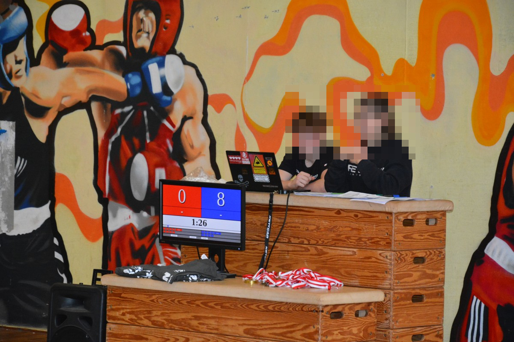

# English

This project aims to develop a scoreboard for wrestling tournaments. Use it with a second mirrored screen.

## Instructions 

1. Since this is an old version, you can only use it offline:
  - [Download the files](https://github.com/gruener-campus-malchow/simplescoreboard/archive/refs/heads/archive.zip) and open the `index.html` file with your browser
3. Switch to Full-Screen-Mode
4. Adjust the Layout by zooming in or out (usually `ctrl` `+` or `ctrl` `-`)
5. Play around and test everything

There are some minor bugs. Reload the page if errors occur.

# Deutsch

Dieses Projekt ist eine Punktetafel für Ringkampfturniere. Es ist für einen gespiegelten zweiten Bildschirm gedacht.

## Anleitung 

1. Da dies eine ältere Version ist, kann man das Programm nur offline benutzen:
 - [Lade die Dateien herunter](https://github.com/gruener-campus-malchow/simplescoreboard/archive/refs/heads/archive.zip) und öffne die Datei `index.html` mit einem Browser
3. Stelle den Browser auf Vollbildmodus
4. Passe das Layout durch herein- oder herauszoomen an (meist mit `strg` `+` oder `strg` `-`)
5. Spiel mit den Funktionen und probiere alles aus

Es gibt ein paar kleine Fehler. Lade im Zweifelsfall die Seite neu.

