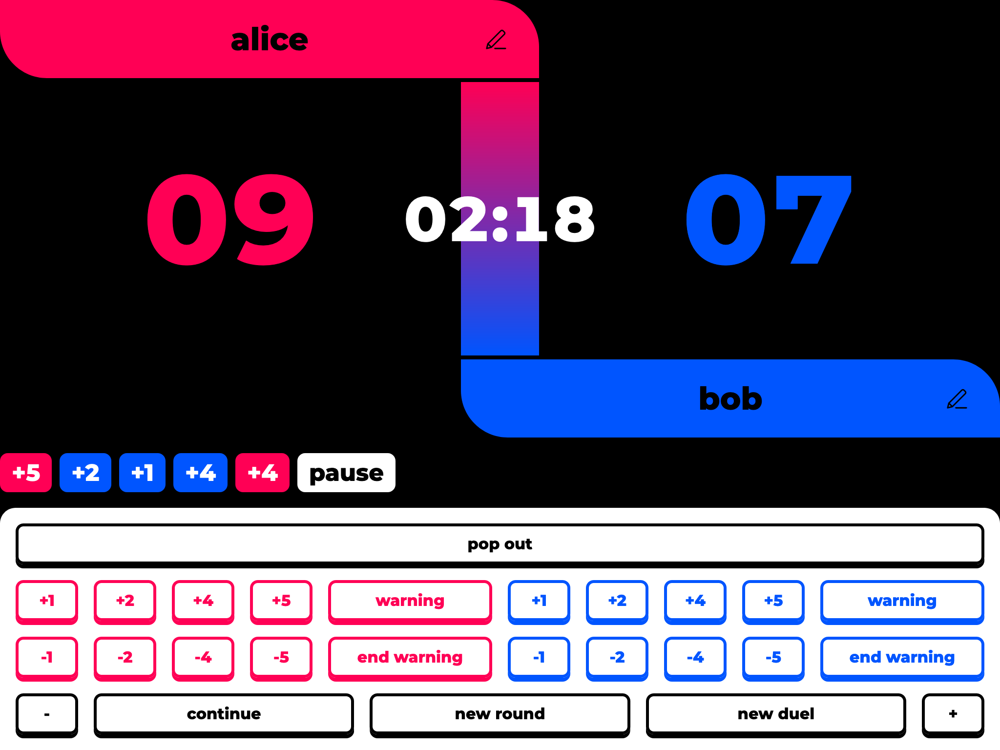
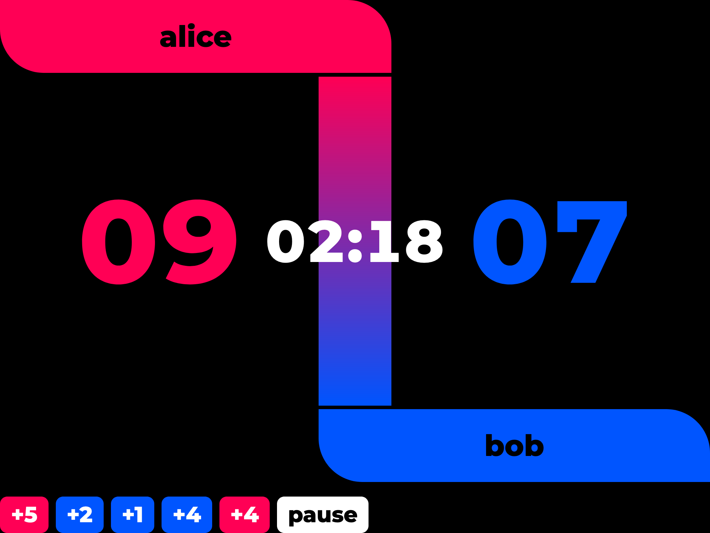
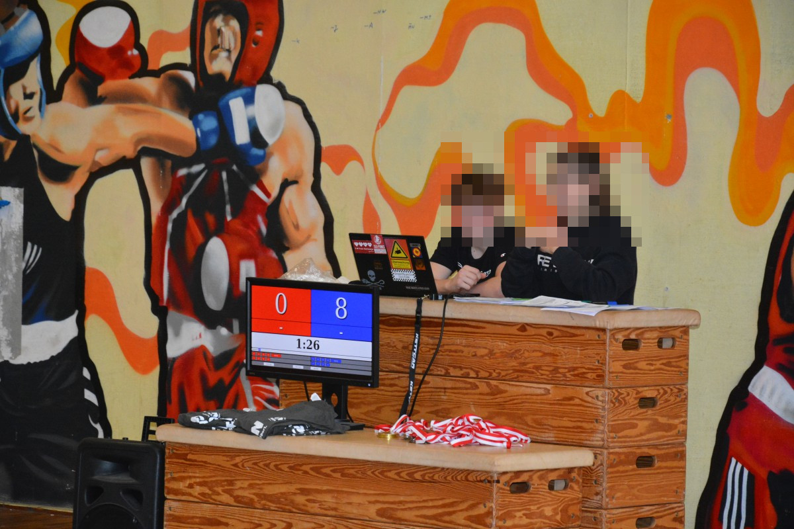

[Deutsche Anleitung](#Deutsch)

# English

This project aims to develop a scoreboard for wrestling tournaments. Use it with a second mirrored screen *or* two full screen windows.

This is a redesign of the simplescoreboard, [you can find the old version here.](https://github.com/gruener-campus-malchow/simplescoreboard/tree/archive#english)

## Instructions

1. You can use it offline or online:
  - **Offline:** [Download the files](https://github.com/gruener-campus-malchow/simplescoreboard/archive/refs/heads/master.zip) and open the `index.html` file with your browser.
  - **Online:** Go to https://gruener-campus-malchow.github.io/simplescoreboard/
2. Switch to Full-Screen-Mode
  - **For mirrored screens:** Simply activate the browser's full screen mode by pressing `f11`.
  - **For seperate windows:** You can open a second window (without controls, just the score board) by pressing the `pop out` button. This second window can be put into full screen by pressing `f11`, or by clicking the score board on the second window.
3. Adjust the Layout by zooming in or out (usually `ctrl` `+` or `ctrl` `-`), or by using the `+` and `-` buttons.
4. Play around and test everything.

~~There are some minor bugs. Reload the page if errors occur.~~ There are no bugs. The software is perfect. – [eintyp](https://github.com/eintyp)

# Deutsch

Dieses Projekt ist eine Punktetafel für Ringkampfturniere. Es ist ursprünglich für einen gespiegelten zweiten Bildschirm gedacht, kann aber auch über ein zweites Vollbild-Fenster betrieben werden.

Wir haben das simplescoreboard überarbeitet, [hier gibt es die alte Version.](https://github.com/gruener-campus-malchow/simplescoreboard/tree/archive#deutsch)

## Anleitung

1. Man kann das Programm offline oder online benutzen:
 - **Offline:** [Lade die Dateien herunter](https://github.com/gruener-campus-malchow/simplescoreboard/archive/refs/heads/master.zip) und öffne die Datei `index.html` mit einem Browser.
 - **Online:** Öffne https://gruener-campus-malchow.github.io/simplescoreboard/
2. Stelle den Browser auf Vollbildmodus
  - **Bei gespiegeltem Bildschirm:** Einfach das Browserfenster in den Volbildmodus schalten, das geht in der Regel mit `f11`.
  - **Bei separatem Fenster:** Ein zweites Fenster (ohne Knöpfe, nur mit Punktestand) lässt sich mit dem Knopf `pop out` öffnen. Dieses kann ebenfalls mit `f11` oder durch Klick auf den Punktestand im Vollbildmodus angezeigt werden.
3. Passe das Layout durch herein- oder herauszoomen (meist mit `strg` `+` oder `strg` `-`) oder mit den Knöpfen `+` und `-` an.
4. Spiel mit den Funktionen und probiere alles aus.

~~Es gibt ein paar kleine Fehler. Lade im Zweifelsfall die Seite neu.~~ Es gibt keine Fehler. Die Software ist perfekt. – [eintyp](https://github.com/eintyp)

*Redesign with controls*

*Redesign, scoreboard only*

*Old version, demo of split screen setup*
