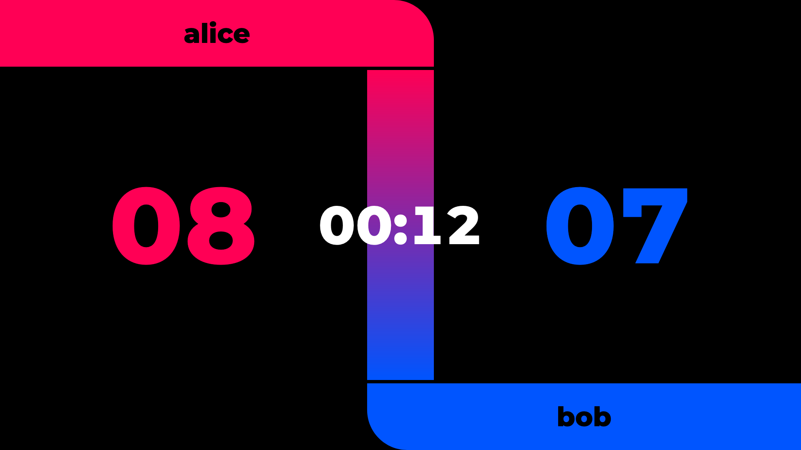

# simplescoreboard

This project aims to develop a scoreboard for wrestling tournaments.

## instructions offline

Download the files and open the index.html with your browser. Switch to Full-Screen-Mode. Adjust the Layout with zooming in or out (often "ctrl +" or "ctrl -").

## instruction online

Go to https://gruener-campus-malchow.github.io/simplescoreboard/. Switch to Full-Screen-Mode. Adjust the Layout with zooming in or out (often "ctrl +" or "ctrl -").
